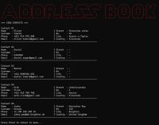

# 🖥️ Address Book Creator (python)

A simple command-line address book application written in Python. The application allows users to add, view, edit and delete contacts, and store contact data in JSON or CSV format.

---

## 🎯 Project Goal

The goal of this project was to:

* work with cycles, functions and with document output by python
* create easy readable and working address book with user-friendly design
* validation and check inputs in corrected way
---

## ⚙️ Features

* Add new contacts
* View all saved contacts
* Edit existing contacts
* Delete contacts
* Choose between JSON and CSV storage
* Save contact data to local files
* Simple colored command-line interface

---

## 🛠️ Technologies Used

* Python
* Json & CSV  

---

## 👍 Pre-requisites

To run this script, make sure you have the following installed:

- Python 3.x
- colorama

Install dependencies:

```bash
pip install colorama

```

### 💻 Supported environments

- Linux / macOS / Windows  
- WSL (Windows Subsystem for Linux)

---

## 🚀 Installation

```bash

git clone https://github.com/MartinTomcikMT/address-book-creator.git
cd address-book-creator
python src/addressbook.py

```

---

## ▶️ How to Run

```bash
python srd/addressbook.py
```

---

## 🚀 How It Works

1. User runs the script  
2. Interactive menu is displayed  
3. Choose option (add, view, edit and delete contact)
4. Process the option
---

## 🧠 What I Learned

- Working with user input in Python
- Using loops and conditional logic inside functions
- Reading and writing data to JSON and CSV files
- Structuring a simple command-line application
- Handling basic file checks and input validation

---

## ⚠️ Challenges & Solutions

### Problem:

The contact display was difficult to read when all fields were printed in a simple list.

### Solution:

I improved the output formatting by displaying contact details in a structured two-column layout and separating individual contacts with visual dividers.

---

## 📸 Screenshot

<p align="center">
  <table>
    <tr>
      <td align="center">
        <a href="images/addressbook_menu.jpg" target="_blank">
          
        </a><br/>
        <sub>Address Book menu</sub>
      </td>
      <td align="center">
        <a href="images/addressbook_adduser.jpg" target="_blank">
          
        </a><br/>
        <sub>Add user</sub>
      </td>
      <td align="center">
        <a href="images/addressbook_displayusers.jpg" target="_blank">
          
        </a><br/>
        <sub>Display users</sub>
      </td>
    </tr>
  </table>
</p>

---

## 📃 Project Structure

```text
address-book-creator/
├── data/
│   └── contacts.json
├── images/
│   └── screenshots
├── src/
│   ├── addressbook.py
├── .gitignore
└── README.md

```

---

## 📌 Future Improvements

- Add search functionality and data validation.  
- Refactor code structure and improve usability.

---

## 👤 Author

Martin Tomcik  
Aspiring DevOps Engineer ☁️
